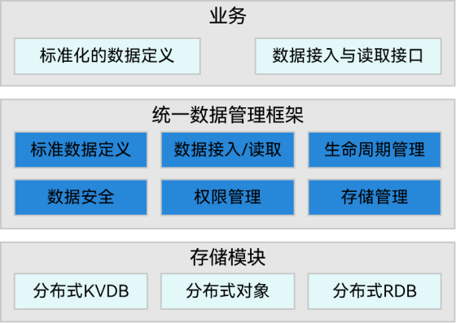
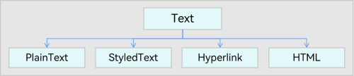

# 统一数据管理框架

## 简介

依据OpenHarmony构建“面向全场景、全连接、全智能时代的分布式操作系统”的愿景，人与数字世界的交互将发生巨大的变化。传统的用户在单设备以应用为中心的交互方式，远远达不到万物互联全场景体验要求：
1） 硬件设备是有边界的
2） 用户与设备之间的交互体验是割裂的，有边界的；
3） 服务以应用为载体，既无法打破进程边界，更无法打破设备间的边界；
4） 用户与服务过程中产生的数据被孤立在应用内、设备内，数据也是有边界的；
从数据管理角度出发，OpenHarmony中数据的跨应用、跨设备流转不断创新，流转过程中存在数据协同通道繁杂、标准不一致；存在应用适配复杂度高、数据协同时安全策略不一致、开发者以及工作量不断提高等痛点问题；统一数据管理框架（Unified Data Management Framework, UDMF）旨在定义数据跨应用、跨设备以及跨平台过程中的标准化，提供统一的标准化通道，从而打破OpenHarmony中共享数据的应用与设备边界，为用户提供全新的分布式数据体验。

## 基本概念

## 架构介绍
**统一的OpenHarmony数据语言：** 构建OpenHarmony数据跨应用/设备交互标准化，降低应用/业务数据交互成本，促进数据生态建设。
**标准化数据接入与读取：** 提供安全、标准化数据通路，降低业务跨应用数据交互成本。
**图1** UDMF架构图



### 标准化数据定义

**基础数据类型：** File、Text等，能够进行跨应用、跨设备、跨平台流转，如图1和2所示。


**图2** UDMF File数据类型示意图


**图2** UDMF Text数据类型示意图



##### 系统相关数据类型（System-Defined Type, SDT）

与具体的平台/操作系统绑定，如UI卡片、PixelMap等，该类数据可以实现系统/平台内的跨应用与跨设备流转，如图3所示。
**图3** UDMF SDT数据类型示意图


##### 应用自定义数据类型（App-Defined Type, ADT）

单个应用自己定义的数据，该类数据可以实现应用内的跨平台与跨设备流转，如图4所示。
**图2** UDMF ADT数据类型示意图


### 标准化数据通路

UDMF中数据通路以及通路中数据统一管理的URI定义：udmf://intension/bundleName/groupName/guid
其中，
**udmf:** 协议名，表示使用UDMF提供的数据通路；
**intension:** 通道分类，例如Drag(拖拽数据)，SuperHub(中转站)等；
**bundleName:** 数据来源业务名称；
**groupName:** 分组名称，支持批量数据分组管理；
**guid:** 系统生成的数据id，全局唯一性。

## 约束限制

- UDMF中每条协同数据记录大小不超过2MB
- UDMF支持数据记录Group概念，每个Group最多支持512条数据，整体大小不超过4MB。

## 目录

UDMF项目仓的代码**目录结构**以及对应目录的**功能描述如下所示：

```undefined
foundation/distributeddatamgr/udmf  # udmf统一数据管理部件
├── frameworks                      # udmf的核心逻辑
│   ├── common                      # 公共工具
│   ├── innerkitsimpl               # nativie接口具体实现
│   │   ├── client                  # native客户端
│   │   ├── common                  # native接口公共工具类
│   │   ├── data                    # 数据结构定义
│   │   └── test                    # 测试目录
│   ├── jskitsimpl                  # public接口具体实现
│   │   ├── common                  # public接口公共工具类
│   │   └── data                    # 统一数据公共接口实现
│   ├── manager                     # 数据管理核心类
│   │   ├── preprocess              # 预处理
│   │   └── store                   # 存储策略
│   └── service                     # 服务模块
├── interfaces                      # udmf对外接口声明
│   ├── innerkits                   # nativie接口声明
│   │   ├── client                  # client接口声明
│   │   ├── common                  # 公共工具类声明
│   │   └── data                    # 数据结构声明
│   └── jskits                      # napi接口声明
│       ├── common                  # napi工具类声明
│       ├── data                    # napi数据封装声明
│       └── module                  # 统一数据模块注册
├── service                         # udmf服务框架代码
│   ├── include                     # 服务端声明
│   └── src                         # 服务端具体实现
├── BUILD.gn                        # 编译配置文件
├── bundle.json                     # 模块配置文件
└── udmf.gni                        # 编译配置头文件
```

## 接口说明

### 导入模块

```js
import UDMF from '@ohos.data.UDMF';
```

### UnifiedDataType

```UnifiedData```中各```UnifiedRecord```数据类型。
**系统能力：** SystemCapability.DistributedDataManager.UDMF.Core

| 名称                     | 说明             |
| ------------------------ | ---------------- |
| TEXT                     | 文本类型         |
| PLAIN_TEXT               | 纯文本类型       |
| HYPER_LINK               | 超链接类型       |
| HTML                     | 富文本类型       |
| IMAGE                    | 图片类型         |
| VIDEO                    | 视频类型         |
| SYSTEM_DEFINED_RECORD    | 系统服务数据类型 |
| SYSTEM_DEFINED_FORM      | 卡片类型         |
| SYSTEM_DEFINED_APP_ITEM  | 图标类型         |
| SYSTEM_DEFINED_PIXEL_MAP | 二进制图片类型   |

### UnifiedData

表示UDMF数据对象，提供封装一组数据记录的方法。
仅是按照统一数据规范创建数据，并未写入存储中。
**系统能力：** SystemCapability.DistributedDataManager.UDMF.Core

#### constructor

constructor(record: UnifiedRecord)
用于创建带有一条数据记录的```UnifiedData```对象。
**系统能力：** SystemCapability.DistributedDataManager.UDMF.Core
**参数：**

| 参数名 | 类型          | 必填 | 说明                        |
| ------ | ------------- | ---- | --------------------------- |
| record | UnifiedRecord | Y    | UnifiedData中携带的数据记录 |

#### addRecord

addRecord(record: UnifiedRecord): void;
在当前```UnifiedData```对象中添加一条记录。
**系统能力：** SystemCapability.DistributedDataManager.UDMF.Core
**参数：**

| 参数名 | 类型          | 必填 | 说明                        |
| ------ | ------------- | ---- | --------------------------- |
| record | UnifiedRecord | Y    | UnifiedData中携带的数据记录 |

**示例：**

```
import UDMF from '@ohos.data.UDMF';

let text = new UDMF.PlainText();
text.textContent = "Hello world!";
let unifiedData = new UDMF.UnifiedData(text);

let text2 = new UDMF.PlainText();
text2.textContent = "Hello, OpenHarmony!";
unifiedData.addRecord(text2);
```

#### getRecords

getRecords(): Array\<UnifiedRecord\>;
将当前UnifiedData对象中的所有UnifiedRecord取出。
**系统能力** ：SystemCapability.DistributedDataManager.UDMF.Core
**返回值：**

| 类型                   | 描述                       |
| ---------------------- | -------------------------- |
| Array\<UnifiedRecord\> | 向当前数据对象内添加的记录 |

**示例：**

```
import UDMF from '@ohos.data.UDMF';

...

let records = unifiedData.getRecords();
console.log("array size is: " + records.size());
```

### Summary

描述某一```UnifiedData```对象的数据摘要。
**系统能力：** SystemCapability.DistributedDataManager.UDMF.Core
**属性定义：**

| 属性名    | 类型                      | 可读 | 可写 | 说明                                                         |
| --------- | ------------------------- | ---- | ---- | ------------------------------------------------------------ |
| symmary   | { [key: string]: number } | Y    | N    | 是一个字典类型对象，key为UnifiedDataType类型，value为UnifiedData对象中key类型记录数据量总和（当前文件类型记录仅记录uri大小，非文件大小） |
| totalSize | number                    | Y    | N    | UnifiedData对象内记录总大小                                  |

**示例：**

```
import UDMF from '@ohos.data.UDMF';

getSummaryCallback(data, err) {
    let summary = data;
    console.log("total: " + summary.totalSize);
}
```

### UnifiedRecord

对UDMF数据支持的数据内容的抽象定义，称为记录，一个统一数据对象内包含一条或多条记录，例如一条文本记录，一条图片记录，一条HTML记录等。
UnifiedRecord是一个抽象父类，无法保存具体数据内容，应用在使用时，不能将其添加到UnifiedData中，而应该创建带有数据内容的具体子类，如```Text```，```Image```等。
**系统能力**：SystemCapability.DistributedDataManager.UDMF.Core

#### getType

getType(): UnifiedDataType;
获取当前UnifiedRecord的类型。
由于从UnifiedData中调用```getRecords```取出数据都是```UnifiedRecord```对象，因此需要通过该接口查询该条记录的具体类型，将```UnifiedRecord```对象转换为其子类，调用子类接口。
**系统能力** ：SystemCapability.DistributedDataManager.UDMF.Core
**返回值：**

| 类型            | 说明                           |
| --------------- | ------------------------------ |
| UnifiedDataType | 当前数据记录对应的具体数据类型 |

**示例：**

```
import UDMF from '@ohos.data.UDMF';

let text = new UDMF.PlainText();
text.textContent = "Hello world!";
let unifiedData = new UDMF.UnifiedData(text);

let text2 = new UDMF.PlainText();
text2.textContent = "Hello, OpenHarmony!";
unifiedData.addRecord(text2);

let records = unifiedData.getRecords();
if (records[0] != null && records[0].getType() == UnifiedDataType.PlainText) {
    console.log(((UDMF.Text)record[0]).content);
}
```

## 开发步骤

以一次创建数据（包含图片、纯文本、二进制图片三条数据记录）为例，说明开发步骤。

1. 导入`@ohos.data.UDMF`模块
   
   ```js
   import UDMF from '@ohos.data.UDMF';
   ```
2. 创建图片数据记录，并初始化得到带有该数据记录的UnifiedData对象
   
   （1）创建图片数据记录
   
   ```js
   let image = new UDMF.Image();
   ```
   
   （2）修改对象属性
   
   ```js
   // Image对象包含一个属性imageUri
   image.imageUri = '...';
   ```
   
   （3）访问对象属性
   
   ```js
   console.info(`imageUri = ${image.imageUri}`);
   ```
   
   （4）创建一个统一数据对象实例
   
   ```js
   let unifiedData = new UDMF.UnifiedData(image);
   ```
3. 创建纯文本数据类型记录，将其添加到刚才创建的UnifiedData对象
   
   ```js
   let plainText = new UDMF.PlainText();
   plainText.textContent = 'this is textContent of plainText';
   plainText.abstract = 'abstract of plainText';
   plainText.details = {
     plainKey1: 'plainValue1',
     plainKey2: 'plainValue2',
   };
   unifiedData.addRecord(plainText);
   ```
4. 创建二进制图片数据类型记录，将其添加到UnifiedData对象
   
   ```js
   let sdPixelMap = new UDMF.SystemDefinedPixelMap();
   sdPixelMap.rawData = new Uint8Array([1, 2, 3, 4, 5, 6, 7, 8, 9, 10]);
   unifiedData.addRecord(sdPixelMap);
   ```
5. 记录添加完成后，可获取当前UnifiedData对象内的所有数据记录
   
   ```js
   let records = unifiedData.getRecords();
   ```
6. 遍历每条记录，判断该记录的数据类型，转换为子类对象，得到原数据记录
   
   ```js
   for (let i = 0; i < records.length; i ++) {
     // 读取该数据记录的类型
     let type = records[i].getType();
     switch (type) {
       case UDMF.UnifiedDataType.IMAGE:
         // 转换得到原图片数据记录
         let image = <UDMF.Image>(records[i]);
         break;
       case UDMF.UnifiedDataType.PLAIN_TEXT:
         // 转换得到原文本数据记录
         let plainText = <UDMF.PlainText>(records[i]);
         break;
       case UDMF.UnifiedDataType.SYSTEM_DEFINED_PIXEL_MAP:
         // 转换得到原二进制图片数据记录
         let sdPixelMap = <UDMF.SystemDefinedPixelMap>(records[i]);
         break;
       default:
         break;
     }
   }
   ```
